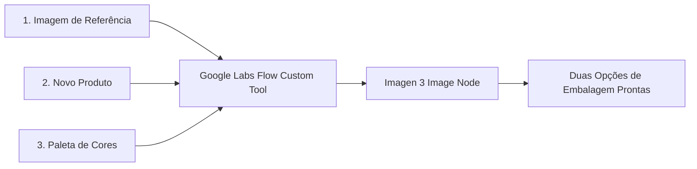

# Manual Operacional de Design de Embalagens com IA (Google Labs Flow)

Este guia prático foi criado para que os **Account Managers (Gestores de Conta)** possam validar e aprovar rapidamente linhas visuais de embalagens com os clientes, gerando variações estéticas e extensões de linha diretamente no **Google Labs Flow** sem depender de arquivos `.ai` ou `.cdr`.

> 📌 **Metodologia Modular de Prompts Isolados (4 Elementos)**: Para gerar e montar embalagens separando Logo, Nomenclatura/Lettering, Render Hero com Película Flutuante, Fundo e Arte Final, consulte o manual detalhado em [fluxo_embalagem_4_elementos.md](file:///c:/Users/bruno/.gemini/antigravity-ide/scratch/workana_packaging_ai/fluxo_embalagem_4_elementos.md).

---

## 1. O que é o Google Labs Flow e como ele nos ajuda?

O **Google Labs Flow** é uma ferramenta de IA visual baseada em "Nós" (nodes) que permite criar um aplicativo no-code simplificado. Nós criamos um pipeline por trás e entregamos aos gestores uma tela limpa contendo apenas campos para digitar em português e um botão de gerar.



---

## 2. Configurando a Ferramenta no Flow (Setup Inicial)

Para configurar a ferramenta para o seu time comercial, siga este mapeamento de nós dentro do Google Labs Flow:

1. **Adicionar Nós de Entrada (Inputs)**:
   - **Upload de Imagem (Image Input)**: Nomeie como `original_design`. Aqui o gestor fará o upload da embalagem de referência pronta (1 a 5 designs originais).
   - **Texto Curto (Text Input)**: Nomeie como `product_name`. Onde o gestor digita o novo produto (Ex: "Película de Lente", "Boards", "Capa TPU").
   - **Texto Curto (Text Input)**: Nomeie como `colors`. Onde o gestor digita a paleta de cores (Ex: "Verde limão e preto fosco").
   - **Texto Curto (Text Input)**: Nomeie como `style_notes`. Detalhes adicionais (Ex: "Acabamento fosco", "Janela transparente").

2. **Adicionar Nó de Template de Prompt (Prompt Builder)**:
   - Crie um nó do tipo **Text Template** e insira o seguinte texto em português (otimizado para a IA):
     ```text
     Maquete de embalagem com vista frontal plana e perfeitamente reta (flat orthogonal front shot), posicionada diretamente de frente para a câmera, sem ângulo de inclinação e sem mostrar as laterais (no perspective or side views). É uma embalagem de varejo para {{product_name}}, apresentando um design moderno e limpo. Paleta de cores: {{colors}}. O estilo visual, grade de posicionamento de logotipo, elementos de design gráfico e layout de tipografia devem corresponder à imagem de referência {{original_design}}. Materiais e textura: {{style_notes}}. Iluminação de estúdio, fundo limpo, texturas realistas.
     ```

3. **Adicionar Nó de Geração de Imagem (Image Generator)**:
   - Conecte a saída do **Prompt Builder** no campo `Prompt` do gerador de imagem.
   - Conecte o nó `original_design` no campo `Style Reference` (Referência de Estilo) ou `Image Input` do gerador de imagem para manter a consistência de marca.

4. **Compartilhar a Ferramenta**:
   - Publique/Compartilhe o link do Flow criado para que os 4 gestores possam usá-lo como um formulário simplificado.

---

## 3. Guia de Preenchimento para os Account Managers

Quando o cliente pedir um novo produto na linha, o gestor de contas só precisa abrir o link do Flow e preencher o formulário conforme os templates abaixo (tudo em português!):

### A) Exemplo 1: Cartela de Embalagem de Varejo (Frame Ultimate - 3 Furos)
*Se a embalagem original de referência for estendida para a Cartela física vertical de varejo:*
* **Imagem de Referência**: `[Subir arquivo da embalagem pronta, ex: case_screen_exemplo.jpeg]`
* **Novo Produto (`product_name`)**: `Cartela de embalagem de varejo para protetor de lente de câmera de celular, com vista perfeitamente frontal e reta (flat orthogonal front shot). A embalagem é uma cartela retangular vertical com cantos arredondados, apresentando um recorte semi-circular no canto superior direito para baixo`
* **Paleta de Cores (`colors`)**: `Padrões de círculos brilhantes em verde neon vibrante sobre um fundo cinza escuro`
* **Notas de Estilo (`style_notes`)**: `Materiais e textura: papelão escuro premium, com três furos circulares grandes no centro para lentes de câmera, com bordas brilhantes em neon. O layout e a composição devem seguir o estilo de design da imagem de referência. Apresentação em estúdio limpo, fotorealista.`

### A2) Exemplo 1B: Cartela de Embalagem de Varejo (Frame Ultimate - 2 Furos Verticais - Recorte Direito)
*Se a embalagem original de referência for estendida para a Cartela física de 2 furos verticais:*
* **Imagem de Referência**: `[Subir arquivo da embalagem pronta]`
* **Novo Produto (`product_name`)**: `Cartela de embalagem de varejo para protetor de lente de câmera de celular, com vista perfeitamente frontal e reta (flat orthogonal front shot). A embalagem é uma cartela retangular vertical com cantos arredondados, apresentando um recorte semi-circular no canto superior direito para baixo`
* **Paleta de Cores (`colors`)**: `Padrões de círculos brilhantes em verde neon vibrante sobre um fundo cinza escuro`
* **Notas de Estilo (`style_notes`)**: `Materiais e textura: papelão escuro premium, com dois furos circulares grandes no centro-inferior para lentes de câmera, alinhados verticalmente, com bordas brilhantes em neon. O layout e a composição devem seguir o estilo de design da imagem de referência. Apresentação em estúdio limpo, fotorealista.`

### B) Exemplo 2: Película de Tela de Celular (Caixa / Cartucho 180x83x8 mm)
*Se a embalagem de referência for estendida para películas de tela no formato padrão de caixas cartucho esguias:*
* **Gabarito de Referência (Faca)**: [cartucho_gabarito_180X83X8MM.png](file:///C:/Users/bruno/.gemini/antigravity-ide/scratch/workana_packaging_ai/cartucho_gabarito_180X83X8MM.png) (caixa vertical com furo central na parte superior).
* **Imagem de Referência**: `[Subir arquivo da embalagem pronta, ex: pangox_original.jpeg]`
* **Novo Produto (`product_name`)**: `Caixa tipo cartucho retangular vertical para película de tela de celular, com vista perfeitamente frontal e reta (flat orthogonal front-facing view). Dimensões proporcionais exatas de 180x83x8 mm e furo tipo Euro slot no topo centro para pendurar`
* **Paleta de Cores (`colors`)**: `Verde neon vibrante e preto fosco profundo`
* **Notas de Estilo (`style_notes`)**: `O design impresso na frente é minimalista e limpo, sem poluição visual. Papelão de acabamento fosco premium.`

### C) Exemplo 3: Placas de Apresentação (Boards)
*Para placas de apresentação ou suportes rígidos de produto:*
* **Gabarito de Referência (Faca)**: Baseado na mesma caixa vertical [cartucho_gabarito_180X83X8MM.png](file:///C:/Users/bruno/.gemini/antigravity-ide/scratch/workana_packaging_ai/cartucho_gabarito_180X83X8MM.png) (com furo central na parte superior).
* **Imagem de Referência**: `[Subir arquivo da embalagem pronta]`
* **Novo Produto (`product_name`)**: `Luva de embalagem para placa de apresentação de produto, com vista perfeitamente frontal e reta (flat orthogonal front-facing view) e furo tipo Euro slot no topo centro para pendurar`
* **Paleta de Cores (`colors`)**: `Dourado metálico sobre papelão preto fosco profundo`
* **Notas de Estilo (`style_notes`)**: `Vista de frente, papelão rígido com acabamento fosco de luxo, bordas limpas e marcantes. O design impresso na frente é minimalista e limpo, sem poluição visual.`

### D) Exemplo 4: TPU Transparente (Efeito Acrílico/Plástico)
*Para simular a embalagem com material transparente mostrando a capinha do celular:*
* **Gabarito de Referência (Faca)**: Baseado na mesma caixa vertical [cartucho_gabarito_180X83X8MM.png](file:///C:/Users/bruno/.gemini/antigravity-ide/scratch/workana_packaging_ai/cartucho_gabarito_180X83X8MM.png) (com furo central na parte superior).
* **Imagem de Referência**: `[Subir arquivo da embalagem pronta]`
* **Novo Produto (`product_name`)**: `Caixa de embalagem retangular vertical para capinha de celular, com vista perfeitamente frontal e reta (flat orthogonal front-facing view) e furo tipo Euro slot no topo centro para pendurar`
* **Paleta de Cores (`colors`)**: `Bordas brancas minimalistas com face frontal de plástico acrílico transparente`
* **Notas de Estilo (`style_notes`)**: `De frente, mostrando a capinha transparente dentro da caixa com reflexo brilhante. O design impresso na frente é minimalista e limpo, sem poluição visual.`

### E) Exemplo 5: TPU Fosco (Matte)
*Para simular material fosco e opaco para a capinha de celular:*
* **Gabarito de Referência (Faca)**: Baseado na mesma caixa vertical [cartucho_gabarito_180X83X8MM.png](file:///C:/Users/bruno/.gemini/antigravity-ide/scratch/workana_packaging_ai/cartucho_gabarito_180X83X8MM.png) (com furo central na parte superior).
* **Imagem de Referência**: `[Subir arquivo da embalagem pronta]`
* **Novo Produto (`product_name`)**: `Caixa tipo luva de embalagem retangular vertical para capinha de celular, com vista perfeitamente frontal e reta (flat orthogonal front-facing view) e furo tipo Euro slot no topo centro para pendurar`
* **Paleta de Cores (`colors`)**: `Cinza escuro fosco e detalhes em cinza escuro`
* **Notas de Estilo (`style_notes`)**: `De frente, textura de silicone macia ao toque e acabamento de superfície anti-reflexo. O design impresso na frente é minimalista e limpo, sem poluição visual.`

### F) Exemplo 6: Cartucho de Varejo de Lentes (Cartucho Frame - 100x83x13 mm)
*Para criar a maquete de varejo do protetor de lentes:*
* **Gabarito de Referência (Faca)**: [cases_brasil_frame_100x83x13.png](file:///C:/Users/bruno/.gemini/antigravity-ide/scratch/workana_packaging_ai/cases_brasil_frame_100x83x13.png) (caixa vertical tipo cartucho de 100x83x13 mm com aba Euro slot centralizada no topo).
* **Imagem de Referência**: `[Subir arquivo da embalagem pronta, ex: artes_capitão_américa.png]`
* **Novo Produto (`product_name`)**: `Caixa tipo cartucho retangular vertical para protetor de lente de câmera de celular, com vista perfeitamente frontal e reta (flat orthogonal front-facing view). Dimensões físicas proporcionais exatas de 100x83x13 mm e aba com furo tipo Euro slot no topo centro para pendurar`
* **Paleta de Cores (`colors`)**: `Preto fosco profundo com faixa azul no canto esquerdo e grafismos em vermelho, branco e azul`
* **Notas de Estilo (`style_notes`)**: `O design impresso na frente exibe uma grande ilustração circular do escudo do Capitão América na lateral esquerda, o título vertical "FRAME SLIM" em azul e branco, e a face traseira exibe especificações técnicas e diagrama técnico de anéis em traços brancos sobre fundo preto. Papelão rígido premium com laminação fosca.`

---

## 4. Guia de Customização e Engenharia de Prompts (Como Editar os Prompts)

Como este fluxo de trabalho é totalmente baseado em **Engenharia de Prompts**, é essencial que os gestores de conta entendam como editar as variáveis de texto para atender às exigências do cliente em tempo real.

### A) A Anatomia de um Prompt de Embalagem
Nossos prompts seguem uma estrutura previsível. Ao editar, ajuste a parte específica do texto:
1. **Ângulo da Câmera (Vista Frontal Reta)**: Para evitar que a embalagem saia na diagonal (como em uma maquete 3D inclinada), o prompt deve conter instruções claras de câmera: `vista frontal plana e perfeitamente reta (flat orthogonal front shot)`.
2. **Paleta de Cores**: Altere as descrições de cor (ex: mudar de `verde neon vibrante` para `azul marinho e preto fosco`).
3. **Textos e Logotipos**: Não descreva textos, marcas, modelos ou especificações de celular no prompt de texto. A IA herdará esses elementos gráficos diretamente da imagem de referência de estilo (Style Reference) carregada no Flow.

### B) Tabela de Ajustes Rápidos no Prompt

Se o cliente pedir alguma alteração, use esta tabela para saber exatamente o que alterar ou adicionar na escrita do prompt:

| Objetivo da Alteração | O que adicionar / editar no Prompt | Exemplo de Frase Otimizada |
| :--- | :--- | :--- |
| **Garantir que fique 100% de frente** | Substitua termos de maquete 3D por vista plana | `vista frontal plana e perfeitamente reta (flat orthogonal front shot)` |
| **Mudar cores** | Altere as cores principais no prompt | `verde neon vibrante e preto fosco profundo` |
| **Mudar materiais (Fosco para Brilho)** | Altere a textura nas notas de estilo | `papelão brilhante laminado com reflexos de luz (glossy paperboard)` |
| **Substituição Localizada (Pincel)** | Pinte a área do erro no Flow e mande instruções de edição | `substituir esta cor de fundo por cinza chumbo` |

> [!TIP]
> **Edição Localizada (Pincel/Inpainting)**:
> Se o layout geral ficou perfeito (cores e posição), mas a IA errou a grafia de alguma palavra ou distorceu um pequeno anel de câmera, use a ferramenta de **Pincel (Brush / Edit Area)** do Flow sobre a imagem gerada, pinte a área do erro e digite a instrução de correção (ex: *"corrigir texto para '[MODELO]'"*).

---

### C) Biblioteca de Modelos Físicos de Aparelhos (Frame Slim)
> Estes blocos estruturais de texto definem a faca física do protetor slim de lentes. **Nunca** altere este trecho para garantir fidelidade às lentes físicas:

* **iPhone 11 - 12 - 12 Mini (Furos Verticais à Esquerda)**:
  ```text
  Com base no arquivo "modelo_slim_iphone11" faça: Maquete profissional em 3D de um protetor de lente de câmera de celular (camera lens protector plate), com vista perfeitamente frontal e reta (flat orthogonal front shot). O protetor é uma peça quadrada com cantos arredondados, apresentando exatamente dois furos circulares vazados alinhados verticalmente no lado esquerdo.
  ```

* **iPhone 16 - 16 Plus / iPhone 17 (Furos Verticais Centrados em "8")**:
  ```text
  Com base no arquivo "modelo_slim_iphone16" faça: Maquete profissional em 3D de um protetor de lente de câmera de celular (camera lens protector plate), com vista perfeitamente frontal e reta (flat orthogonal front shot). O protetor é uma placa retangular vertical com cantos arredondados, apresentando exatamente dois furos circulares vazados de tamanho e diâmetro idênticos, centralizados, alinhados verticalmente e tangentes entre si no meio (formando uma silhueta de algarismo 8).
  ```

* **iPhone 13 - 13 Mini / 14 - 14 Plus / 15 - 15 Plus (Furos Diagonais)**:
  ```text
  Com base no arquivo "modelo_slim_iphone13" faça: Maquete profissional em 3D de um protetor de lente de câmera de celular (camera lens protector plate), com vista perfeitamente frontal e reta (flat orthogonal front shot). O protetor é uma peça quadrada com cantos arredondados, apresentando exatamente dois furos circulares vazados de tamanho e diâmetro idênticos, dispostos de forma diagonal (um no canto superior esquerdo e outro no canto inferior direito).
  ```

* **iPhone 17 Pro - 17 Pro Max (3 Furos Triangulares)**:
  ```text
  Com base no arquivo "modelo_slim_iphone17pro" faça: Maquete profissional em 3D de um protetor de lente de câmera de celular (camera lens protector plate), com vista perfeitamente frontal e reta (flat orthogonal front shot). O protetor é uma peça quadrada com cantos arredondados, apresentando exatamente três furos circulares vazados de tamanho e diâmetro idênticos, dispostos em formato triangular (dois furos alinhados verticalmente no lado esquerdo e um furo centralizado no lado direito).
  ```

---

### E) Biblioteca de Modelos de Cartelas de Embalagem (Frame Ultimate)
> Estes blocos estruturais de texto definem a faca física e o gabarito das cartelas de papelão de varejo para protetor de lentes:

* **Opção 3 Furos (iPhone 17 Pro / Pro Max - Recorte Superior Direito)**:
  ```text
  Com base no arquivo "modelo_ultimate_iphone17pro" faça: Maquete profissional em 3D de uma cartela de embalagem de varejo para protetor de lente de câmera de celular (camera lens protector packaging card), com vista perfeitamente frontal e reta (flat orthogonal front shot). A embalagem é uma cartela retangular vertical com cantos arredondados, apresentando exatamente um recorte côncavo semicircular no topo do canto superior direito orientado para baixo, e exatamente três furos circulares vazados no centro para lentes de câmera, dispostos em formato triangular (dois furos alinhados verticalmente no lado esquerdo e um furo centralizado no lado direito).
  ```

* **Opção 2 Furos Verticais (iPhone 11 / 12 / 16 / 17 - Recorte Superior Direito)**:
  ```text
  Com base no arquivo "modelo_card_recorte_direito_2furos" faça: Maquete profissional em 3D de uma cartela de embalagem de varejo para protetor de lente de câmera de celular (camera lens protector packaging card), com vista perfeitamente frontal e reta (flat orthogonal front shot). A embalagem é uma cartela retangular vertical com cantos arredondados, apresentando exatamente um recorte côncavo semicircular no topo do canto superior direito orientado para baixo, e exatamente dois furos circulares vazados no centro-inferior, alinhados verticalmente um sobre o outro.
  ```

---

### D) Biblioteca de Estilos de Design dos Concorrentes (Os 11 Modelos)
> Estes blocos definem o design, cores e textura que os gestores podem acoplar no final de qualquer prompt base acima:

* **MODELO 01 (Estilo Garras Rasgadas - Inspirado no mypro)**:
  `Paleta de cores: marcas de garras rasgadas em verde-petróleo escuro (dark teal claw marks) sobre um fundo preto fosco, com uma linha de contorno vermelha fina nas bordas externas da peça e ao redor dos furos circulares. O layout e a composição devem seguir o estilo de design da imagem de referência. Materiais e textura: plástico fosco premium, com apresentação em estúdio limpo, fotorealista.`
  *(Substituir: cores `verde-petróleo escuro` e `vermelha` por outras combinadas).*

* **MODELO 02 (Estilo Linhas Mecânicas - Inspirado no InSafe)**:
  `Paleta de cores: linhas e grades vetoriais em tons de roxo profundo e cinza escuro, simulando um padrão blindado mecânico no fundo. O layout e a composição devem seguir o estilo de design da imagem de referência, com finas marcações roxas ao redor dos furos. Materiais e textura: plástico escuro fosco premium, com apresentação em estúdio limpo, fotorealista.`
  *(Substituir: cor do grid `roxo profundo` por tons de verde, cobre ou azul).*

* **MODELO 03 (Estilo Faixa L Magenta - Inspirado no CASES BRASIL)**:
  `Paleta de cores: um grafismo em formato de "L" grosso e curvado na cor rosa/magenta brilhante correndo ao longo da borda esquerda e inferior da peça, com o restante da face frontal da peça em cor preta sólida fosca. O logotipo "cases brasil" e o título "LENS MAX" estão no quadrante superior direito em branco e magenta. O layout e a composição devem seguir o estilo de design da imagem de referência. Materiais e textura: plástico fosco premium, com apresentação em estúdio limpo, fotorealista.`
  *(Exemplo de Edição das Partes: Para alterar as cores das partes (ex: Verde Neon e Cinza Chumbo), o gestor edita as partes destacadas: muda o "L" para "verde neon vibrante", o fundo para "cinza chumbo fosca" e o logotipo/texto para "branco e verde neon").*

* **MODELO 04 (Estilo Faixa Vertical Tech - Inspirado no CELLAIRIS)**:
  `Paleta de cores: fundo cinza escuro dividido ao meio por uma faixa vertical preta grossa centralizada, com linhas e grafismos brilhantes em azul ciano neon decorando as laterais. O layout e a composição devem seguir o estilo de design da imagem de referência. Materiais e textura: plástico fosco premium, com apresentação em estúdio limpo, fotorealista.`
  *(Substituir: cores da faixa e das linhas laterais).*

* **MODELO 05 (Estilo Luxo Minimalista - Inspirado no CASE & COMPANY)**:
  `Paleta de cores: linhas finas e elegantes em dourado metálico brilhante (gold foil) contornando as bordas externas e ao redor dos furos circulares sobre um fundo preto fosco uniforme. O layout e a composição devem seguir o estilo de design da imagem de referência. Materiais e textura: plástico de toque suave premium, com apresentação em estúdio limpo, fotorealista.`
  *(Substituir: contorno `dourado metálico` e fundo `preto fosco` por ouro rosé, prata ou azul marinho).*

* **MODELO 06 (Estilo Elos Octagonais - Inspirado no UP FORCE)**:
  `Paleta de cores: padrões de formas geométricas octagonais entrelaçadas em roxo neon brilhante e cinza sobre o fundo preto. O layout e a composição devem seguir o estilo de design da imagem de referência, apresentando contornos roxos finos ao redor da peça e dos furos. Materiais e textura: plástico escuro fosco premium, com apresentação em estúdio limpo, fotorealista.`
  *(Substituir: elos `roxo neon brilhante` por verde neon ou azul elétrico).*

* **MODELO 07 (Estilo Mosaico / Vitral - Inspirado no GD CASE)**:
  `Paleta de cores: padrão abstrato de mosaico de pedras irregulares (cobblestone pattern) nas cores pêssego, azul turquesa, cinza e preto no plano de fundo. O layout e a composição devem seguir o estilo de design da imagem de referência. Materiais e textura: plástico fosco premium, com apresentação em estúdio limpo, fotorealista.`
  *(Substituir: conjunto de cores do mosaico por tons pastéis ou cinza metálico).*

* **MODELO 08 (Estilo Linhas de Velocidade - Inspirado no ZIVIZ)**:
  `Paleta de cores: padrões densos de linhas finas diagonais e horizontais brilhantes em laranja neon sobre o fundo preto, com contornos laranja finos ao redor dos furos. O layout e a composição devem seguir o estilo de design da imagem de referência. Materiais e textura: plástico escuro fosco premium, com apresentação em estúdio limpo, fotorealista.`
  *(Substituir: cor das linhas `laranja neon` por azul neon, vermelho ou branco frio).*

* **MODELO 09 (Estilo Letra Gigante Lateral - Inspirado no ILOVERS)**:
  `Paleta de cores: fundo preto fosco com uma grande textura de letras estilizadas em cinza chumbo na lateral esquerda da peça, contornando sutilmente os furos. O layout e a composição devem seguir o estilo de design da imagem de referência. Materiais e textura: plástico escuro fosco premium, com apresentação em estúdio limpo, fotorealista.`
  *(Substituir: cor das letras gigantes `cinza chumbo` por preto brilhante ou cinza claro).*

* **MODELO 10 (Estilo Minimalista Escuro Absoluto - Inspirado no TECH SHIELD)**:
  `Paleta de cores: fundo preto fosco absoluto de alta qualidade na cartela, sem grafismos ou texturas adicionais. Apresenta uma linha de contorno extremamente fina e discreta em azul escuro profundo (dark navy blue outline) delimitando as bordas externas da cartela e ao redor de cada um dos furos. O layout e a composição devem seguir o estilo de design da imagem de referência. Materiais e textura: papelão ou plástico fosco premium, com apresentação em estúdio limpo, fotorealista.`
  *(Substituir: cor do contorno de `azul escuro profundo` para cinza, vermelho escuro ou preto brilhante).*

* **MODELO 11 (Estilo Edição Especial Cinza Chumbo - Inspirado no IBLACK - ANZEN)**:
  `Paleta de cores: fundo em cinza chumbo escuro fosco (slate gray matte) na cartela, com linhas de contorno geométricas finas em cinza claro e branco contornando as bordas externas e ao redor de cada um dos furos. O layout e a composição devem seguir o estilo de design premium da imagem de referência. Materiais e textura: papelão ou plástico escuro fosco de toque suave, com apresentação em estúdio limpo, fotorealista.`
  *(Substituir: cor de fundo `cinza chumbo escuro` por azul marinho, verde sálvia ou marrom terracota).*

* **MODELO 12 (Estilo Temático de Herói - Capitão América - CASES BRASIL)**:
  `Paleta de cores: fundo preto fosco profundo, com uma faixa vertical azul-marinho na borda esquerda da face frontal e uma ilustração circular do escudo do Capitão América nas cores vermelho, branco e azul. O título vertical "FRAME SLIM" é exibido em letras grossas azul e branca na face frontal direita. A face traseira exibe especificações técnicas e diagrama em traços brancos sobre preto. O layout e a composição devem seguir o estilo de design da imagem de referência. Materiais e textura: papelão rígido com acabamento fosco premium, com apresentação em estúdio limpo, fotorealista.`
  *(Exemplo de Edição das Partes: Para alterar o tema do herói (ex: Homem de Ferro), altere as partes: faixa lateral para "vermelha", ilustração do escudo para "reator arc em amarelo e azul", e título vertical para "vermelho e dourado").*

---

## 5. Estrutura de Validação de Precificação

Para ajudar a validar a proposta comercial do projeto no Workana para os outros 7 itens da linha:

1. **Aprovação Visual Rápida (Fase 1)**: O tempo gasto pelo gestor de contas para gerar e aprovar a linha usando o Flow cai de **2-3 dias úteis** (fila do designer gráfico) para **5 minutos** em tempo real com o cliente.
2. **Custo de Produção da Variação**: Como o Flow no Google Labs é gratuito para experimentação, o custo operacional de software para essas gerações é de **$0 USD**.
3. **Escalabilidade**: Após validar esta primeira linha de embalagens de protetor de lentes, os próximos 7 itens (Boards, TPU Transparente, TPU Fosco, etc.) podem ser gerados pelos próprios Account Managers em minutos usando as mesmas referências base, sem consumir horas de estúdio de criação.

---

## 6. Guia Prático de Teste (Baseado nos 3 Arquivos Briefing)

Copiamos os arquivos de briefing do seu cliente para a pasta do workspace para que você possa visualizá-los e utilizá-los de forma prática. Aqui está como testar o "bate-bola" comercial usando-os como entrada no Flow:

### Cenário de Teste:
* **Faca / Limite**: [cartucho_gabarito_180X83X8MM.png](file:///C:/Users/bruno/.gemini/antigravity-ide/scratch/workana_packaging_ai/cartucho_gabarito_180X83X8MM.png) (Gabarito da caixa tipo cartucho de películas e acessórios com Euro slot).
* **Referência de Outro Cliente**: [case_screen_exemplo.jpeg](file:///C:/Users/bruno/.gemini/antigravity-ide/scratch/workana_packaging_ai/case_screen_exemplo.jpeg) (Visual "Case & Screen" verde neon com brilho circular).
* **Embalagem Atual**: [pangox_original.jpeg](file:///C:/Users/bruno/.gemini/antigravity-ide/scratch/workana_packaging_ai/pangox_original.jpeg) (Arte original da embalagem Pangox gerada no Flow).

### Saída para Cartela de Protetor de Lente (Estilo Verde Neon e Cinza Escuro)
Esta opção aplica a identidade visual de energia e brilho verde neon no formato de cartela com recorte circular, mantendo a simplicidade do design original fornecido pelo cliente.

* **Como Preencher no Flow**:
  - **Imagem de Referência**: `[Subir a imagem de referência, ex: case_screen_exemplo.jpeg]`
  - **Novo Produto (`product_name`)**: `Cartela de embalagem de varejo para protetor de lente de câmera de celular, com vista perfeitamente frontal e reta (flat orthogonal front shot). A embalagem é uma cartela retangular vertical com cantos arredondados, apresentando um recorte semi-circular no canto superior direito para baixo`
  - **Paleta de Cores (`colors`)**: `Padrões de círculos brilhantes em verde neon vibrante sobre um fundo cinza escuro`
  - **Notas de Estilo (`style_notes`)**: `Materiais e textura: papelão escuro premium, com três furos circulares grandes no centro para lentes de câmera, com bordas brilhantes em neon. O layout e a composição devem seguir o estilo de design da imagem de referência. Apresentação em estúdio limpo, fotorealista.`

> [!TIP]
> **Prompt Pronto Copia-e-Cola (para testar agora na barra do Flow/ImageFX em português)**:
> ```text
> Maquete profissional em 3D de uma cartela de embalagem de varejo para protetor de lente de câmera de celular, com vista perfeitamente frontal e reta (flat orthogonal front shot). A embalagem é uma cartela retangular vertical com cantos arredondados, apresentando um recorte semi-circular no canto superior direito para baixo. Paleta de cores: padrões de círculos brilhantes em verde neon vibrante sobre um fundo cinza escuro. O layout e a composição devem seguir o estilo de design da imagem de referência. Materiais e textura: papelão escuro premium, com três furos circulares grandes no centro para lentes de câmera, com bordas brilhantes em neon. Apresentação em estúdio limpo, fotorealista.
> ```

---

## 7. Como Editar Requisições do Cliente (Ajustes de Layout)

Se o cliente solicitar alterações específicas após a primeira geração, o gestor de contas insere os ajustes no campo em português:

1. **Alterar Localização de Imagens / Logos**:
   - Ajuste o campo `style_notes` adicionando restrições de posicionamento:
     - `logo colocado no centro superior`
     - `texto da marca deslocado para a margem inferior`
     - `anéis de câmera deslocados ligeiramente para baixo`
2. **Alterar Paleta de Cores**:
   - Altere a descrição no campo `colors`:
     - de `verde neon` para `azul marinho e prata cromada` ou `laranja pastel e preto fosco`.
3. **Substituição Localizada (Pincel/Inpainting)**:
   - Se o layout geral ficou perfeito, mas o cliente quer mudar apenas uma parte, use a ferramenta de pincel do Flow para pintar a área desejada e digite a instrução de alteração:
     - `alterar cor dos anéis para vermelho brilhante`
     - `substituir logotipo por um ícone de estrela geométrica`

---

## 8. Biblioteca de Recursos Disponíveis (Referências para a IA)

Todos os arquivos reais e referências enviados pelo cliente foram salvos no seu workspace para uso imediato dos gestores:

* **Facas de Corte e Gabaritos**:
  * [pangox_faca_card.jpeg](file:///C:/Users/bruno/.gemini/antigravity-ide/scratch/workana_packaging_ai/pangox_faca_card.jpeg) – Faca de corte da cartela interna original Pangox.
  * [cartucho_gabarito_180X83X8MM.png](file:///C:/Users/bruno/.gemini/antigravity-ide/scratch/workana_packaging_ai/cartucho_gabarito_180X83X8MM.png) – Gabarito oficial de caixa tipo cartucho vertical de varejo.
  * [obli_faca.jpeg](file:///C:/Users/bruno/.gemini/antigravity-ide/scratch/workana_packaging_ai/obli_faca.jpeg) – Faca de corte antiga do cartucho OBLI.

* **Modelos e Inspirações de Design (Estilos)**:
  * [pangox_competidores_card.jpeg](file:///C:/Users/bruno/.gemini/antigravity-ide/scratch/workana_packaging_ai/pangox_competidores_card.jpeg) – 9 modelos de designs de concorrentes para embalagens de lentes (Ziviz, Cellairis, InSafe, etc.).
  * [modelos_cartuchos_180X83X8mm.png](file:///C:/Users/bruno/.gemini/antigravity-ide/scratch/workana_packaging_ai/modelos_cartuchos_180X83X8mm.png) – 10 modelos de designs de caixas para películas de tela (Nanotech, Case Protect, Zeus, etc.).
  * [pangox_caixa_completa.jpeg](file:///C:/Users/bruno/.gemini/antigravity-ide/scratch/workana_packaging_ai/pangox_caixa_completa.jpeg) – Arte completa da caixa premium da Pangox (Frente, Verso, Kit de limpeza e interior).
  * [case_screen_exemplo.jpeg](file:///C:/Users/bruno/.gemini/antigravity-ide/scratch/workana_packaging_ai/case_screen_exemplo.jpeg) – Arte de referência verde neon da Case & Screen.
  * [pangox_original.jpeg](file:///C:/Users/bruno/.gemini/antigravity-ide/scratch/workana_packaging_ai/pangox_original.jpeg) – Arte original da embalagem Pangox gerada no Flow.
